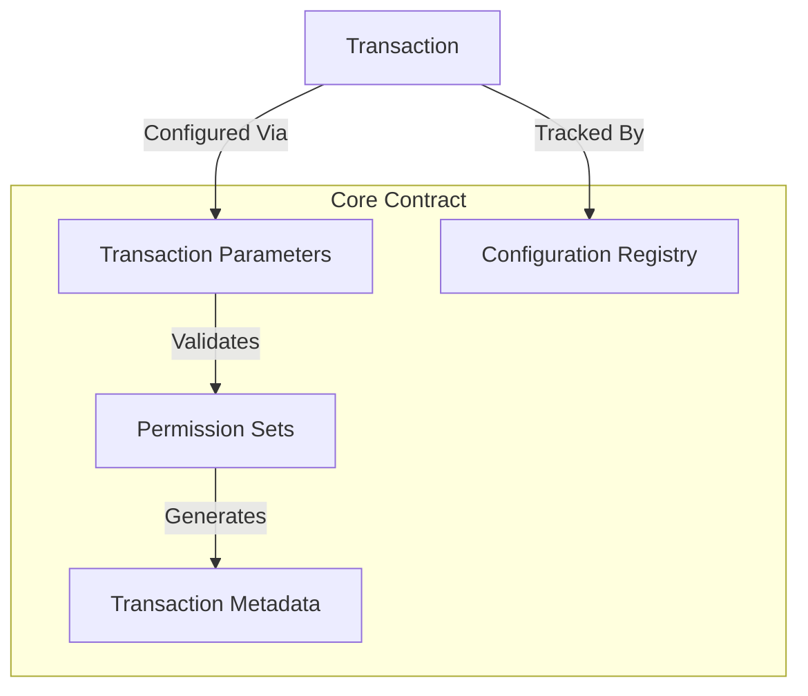

# Configure Transaction

A flexible Clarity smart contract for dynamic transaction configuration and secure management of transaction parameters.

## Overview

Configure Transaction is a sophisticated blockchain solution designed to:
- Provide granular control over transaction configurations
- Enable dynamic permission management
- Support complex transaction metadata
- Enhance transaction security and flexibility

The platform creates a robust, transparent mechanism for defining and managing transaction parameters with fine-grained control.

## Architecture

The system is built around a core smart contract that manages:
- Transaction configuration parameters
- Dynamic permission sets
- Metadata tracking
- Secure transaction validation



## Contract Documentation

### Core Contract (transaction-config.clar)

The main contract managing transaction configuration capabilities.

#### Key Features
- Flexible transaction parameter management
- Dynamic permission control
- Secure metadata tracking
- Comprehensive configuration validation

#### Configuration Types
1. Transaction Parameter Management
2. Permission Set Definition
3. Metadata Tracking
4. Security Validation

## Getting Started

### Prerequisites
- Clarinet
- Stacks wallet for contract interaction
- Basic understanding of blockchain transaction configurations

### Basic Usage

1. Configure a transaction parameter:
```clarity
(contract-call? .transaction-config configure-transaction-param
    "transfer-limit"  ;; parameter name
    u1000             ;; parameter value
    true              ;; is-active
)
```

2. Set transaction permissions:
```clarity
(contract-call? .transaction-config set-transaction-permission 
    "admin-transfer" 
    tx-sender
    true
)
```

## Function Reference

### Public Functions

#### configure-transaction-param
```clarity
(define-public (configure-transaction-param 
    (param-name (string-utf8 64)) 
    (param-value uint) 
    (is-active bool)
))
```
Configures a specific transaction parameter with optional activation status.

#### set-transaction-permission
```clarity
(define-public (set-transaction-permission 
    (permission-name (string-utf8 64)) 
    (user principal) 
    (has-permission bool)
))
```
Sets or revokes transaction permissions for a specific user.

#### validate-transaction
```clarity
(define-public (validate-transaction 
    (transaction-type (string-utf8 64)) 
    (transaction-details (tuple))
))
```
Validates a transaction based on configured parameters and permissions.

### Read-Only Functions

#### get-transaction-param
```clarity
(define-read-only (get-transaction-param (param-name (string-utf8 64)))
```
Retrieves the current configuration for a specific transaction parameter.

#### check-transaction-permission
```clarity
(define-read-only (check-transaction-permission 
    (user principal) 
    (permission-name (string-utf8 64))
))
```
Checks if a user has a specific transaction permission.

## Development

### Testing
1. Install Clarinet
2. Run the test suite:
```bash
clarinet test
```

### Local Development
1. Start a local Clarinet console:
```bash
clarinet console
```
2. Deploy contracts:
```clarity
(contract-call? .transaction-config configure-transaction-param ...)
```

## Security Considerations

### Limitations
- Parameter names limited to 64 UTF-8 characters
- Transaction permissions granularly controlled
- Metadata tracking with size constraints

### Best Practices
- Always validate transaction parameters
- Use principle of least privilege for permissions
- Regularly audit and update transaction configurations
- Implement multi-signature mechanisms for critical transactions